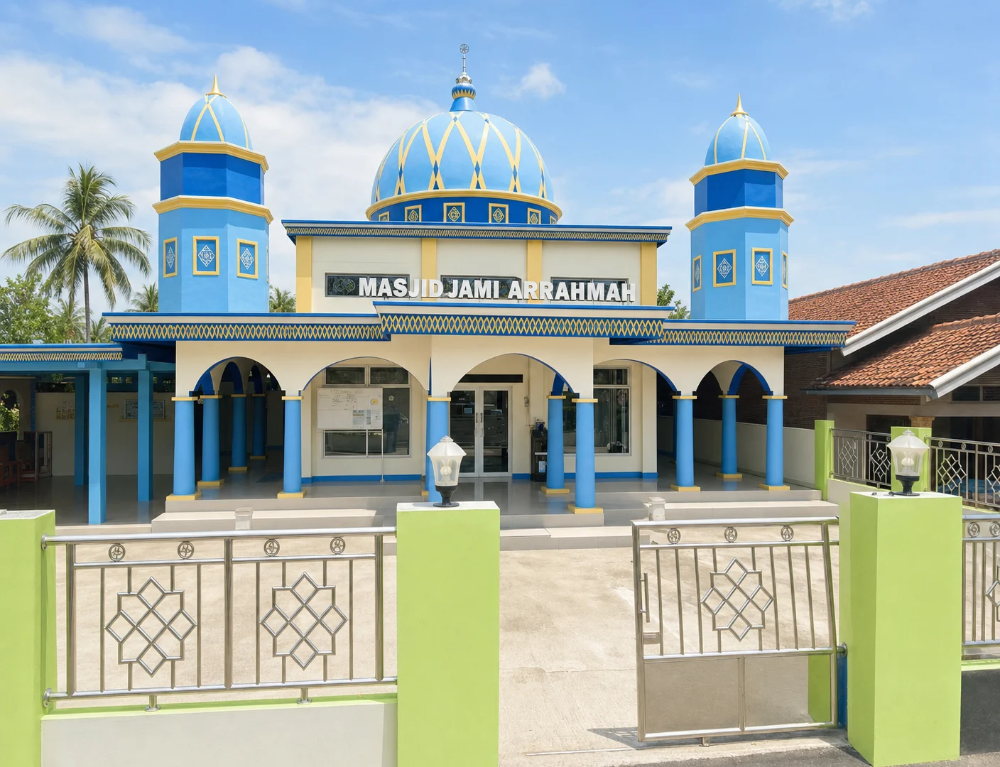

<div align="center">

# Masjid Ar-Rahmah

**Website komunitas dan CMS ringan untuk melayani jamaah Masjid Ar-Rahmah**


</div>



## Tentang proyek

Masjid Ar-Rahmah menyatukan informasi jamaah, jadwal salat, kegiatan, pengajian, artikel, dan administrasi masjid dalam satu aplikasi responsif. Situs publik dibuat ringan untuk pengunjung, sedangkan dashboard terlindungi membantu pengurus mengelola konten dan pencatatan keuangan.

## Fitur utama

| Area            | Kemampuan                                                                                                    |
| --------------- | ------------------------------------------------------------------------------------------------------------ |
| Situs publik    | Beranda, jadwal salat, kegiatan, pengajian, artikel, dan profil masjid                                       |
| Jadwal salat    | Jadwal bulanan untuk 517 kabupaten/kota Indonesia, default Kabupaten Karawang, serta ekspor PDF satu halaman |
| Artikel         | Pencarian, kategori, estimasi waktu baca, metadata SEO, dan bacaan terkait                                   |
| CMS pengurus    | CRUD artikel dan kegiatan, editor rich text, serta unggahan JPG/PNG/WebP tervalidasi                         |
| Keuangan        | Buku kas per sumber dana, filter transaksi, ringkasan saldo, serta ekspor PDF dan Excel                      |
| Akses staf      | Login username dan kata sandi dengan session cookie tanpa pendaftaran publik                                 |
| Keamanan konten | Sanitasi HTML dan rendering konten sebagai node terstruktur                                                  |

## Tech stack

- **SvelteKit 2** dan **Svelte 5 runes**
- **TypeScript 6** dan **Tailwind CSS 4**
- **Better Auth** untuk autentikasi staf
- **Drizzle ORM** dan **SQLite**
- **Vitest** dan **Playwright**
- **PDFKit**, **fflate**, dan **Sharp**

## Menjalankan secara lokal

### Prasyarat

- Node.js 24 atau versi LTS aktif
- npm

### Instalasi

```powershell
git clone https://github.com/RivaldiDev/ar-rahmah.git
Set-Location ar-rahmah
npm install
Copy-Item .env.example .env
npm run auth:schema
npm run db:push
npm run db:seed
npm run dev
```

Buka `http://localhost:5173`. Sebelum menjalankan seeding, isi `BETTER_AUTH_SECRET`, `ADMIN_NAME`, `ADMIN_USERNAME`, `ADMIN_EMAIL`, dan `ADMIN_PASSWORD` di `.env`. Kata sandi admin minimal 16 karakter dan `npm run db:seed` aman dijalankan ulang.

## Struktur proyek

```text
src/
├── lib/
│   ├── components/          komponen situs dan form admin
│   ├── domain/              logika domain dan tipe rich text
│   └── server/              auth, database, sanitasi, media, dan repository
├── routes/
│   ├── artikel/             daftar dan detail artikel
│   ├── jadwal-salat/        jadwal bulanan dan ekspor PDF
│   ├── kegiatan/            agenda masjid
│   ├── pengajian/           jadwal kajian
│   ├── tentang/             sejarah, takmir, lokasi, dan infaq
│   └── admin/               CMS serta laporan keuangan terlindungi
scripts/                     seeding dan migrasi data
static/images/               aset gambar WebP teroptimasi
tests/                       pengujian E2E dan keamanan
```

## Verifikasi

```powershell
npm run check
npm run lint
npm run test:unit -- --run
npx playwright test
npm run build
npm audit
```

## Catatan produksi

Deployment Node memerlukan penyimpanan persisten untuk SQLite dan media. Ganti seluruh kredensial contoh, gunakan `BETTER_AUTH_SECRET` berentropi tinggi, dan konfigurasi origin produksi sebelum aplikasi dibuka untuk publik.
